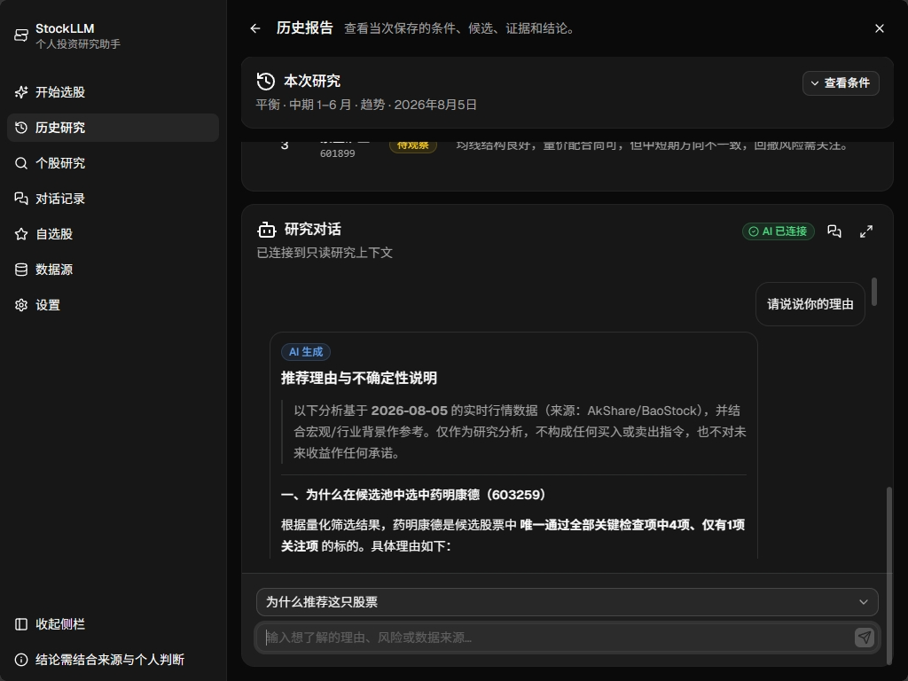
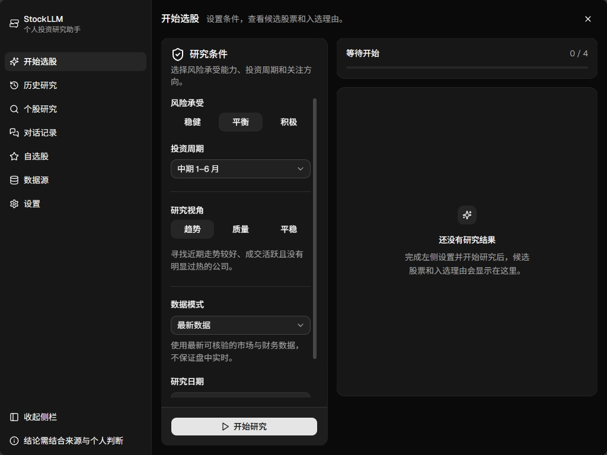
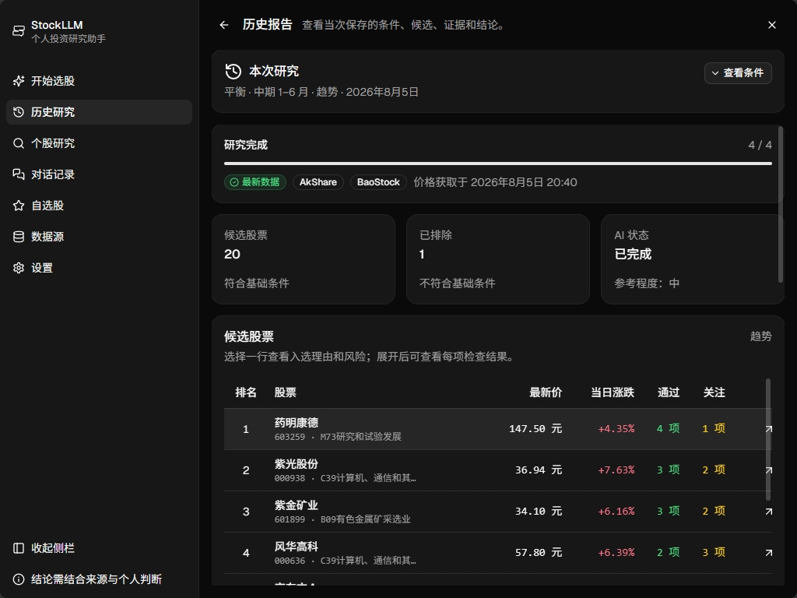
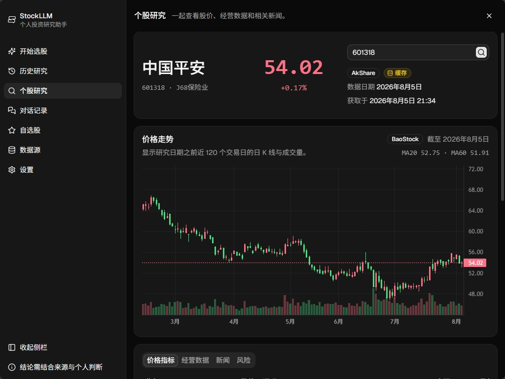

<div align="center">
  
  <h1>StockLLM</h1>
  <p><strong>A local A-share screening and research application.</strong></p>
  <p>
    <a href="README.md">简体中文</a> |
    <a href="README.en.md">English</a>
  </p>
  <p>
    <a href="https://github.com/kevynf/stock-llm/actions/workflows/ci.yml"></a>
    <a href="https://github.com/kevynf/stock-llm/actions/workflows/build-windows-desktop.yml"></a>
    
    
    
    <a href="LICENSE"></a>
  </p>
</div>

StockLLM is a local application for A-share screening and stock research. It combines rule-based screening with optional DeepSeek comparisons and read-only follow-up chats. The project includes a React/FastAPI web application and a Tauri 2 Windows desktop build.

> [!CAUTION]
> StockLLM is for research and education only. It is not investment advice and does not provide automated trading, return guarantees, or personalized wealth-management services.

## Features

- Set a risk profile, investment horizon, research strategy, and research date.
- Screen up to 20 candidates with trend, quality, or low-volatility rules.
- View the source, effective date, fetch time, and availability of market, fundamental, and news data.
- Optionally use DeepSeek to compare screened candidates and answer follow-up questions about the current research data.
- Review candidate tables, price charts, fundamentals, news, risks, saved research, chats, watchlists, and provider status.
- Store research history and watchlists in local SQLite and API keys in the operating-system credential store.

## Screenshots

<table>
  <tr>
    <td width="50%"></td>
    <td width="50%"></td>
  </tr>
  <tr>
    <td align="center"><strong>AI research chat</strong></td>
    <td align="center"><strong>Configurable research workspace</strong></td>
  </tr>
  <tr>
    <td width="50%"></td>
    <td width="50%"></td>
  </tr>
  <tr>
    <td align="center"><strong>Screening results and candidates</strong></td>
    <td align="center"><strong>Stock research and data sources</strong></td>
  </tr>
</table>

## Research Process

1. Choose the risk profile, investment horizon, strategy, and data date.
2. StockLLM loads the required market and company data and records its source and date.
3. The selected rule set produces a candidate list and per-item checks.
4. If DeepSeek is configured, it compares candidates and returns a top three with supporting references.
5. The application saves the conditions, candidates, references, and result as one local research record.

Implementation details are documented separately in [Architecture](docs/architecture.en.md).

## Requirements

- Python 3.12+
- Node.js 20+
- pnpm 9+
- Windows 10/11 for Credential Manager integration and the packaged desktop app

## Quick Start

> [!TIP]
> Windows users can download the latest `StockLLM_<version>_x64-setup.exe` directly from [GitHub Releases](https://github.com/kevynf/stock-llm/releases/latest), without cloning the repository or building it locally.

The repository scripts prepare the required Python and Node.js dependencies. On Windows PowerShell:

```powershell
git clone https://github.com/kevynf/stock-llm.git
cd stock-llm
.\scripts\bootstrap.ps1
```

Start the backend and frontend together:

```powershell
.\scripts\dev.ps1
```

Open <http://127.0.0.1:5173>. Press `Ctrl+C` to stop both services. For debugging, the backend and frontend can still be started independently with `dev-backend.ps1` and `dev-frontend.ps1`.

The bootstrap script uses Tsinghua PyPI and npmmirror for the current installation only. Override them without changing global package-manager settings:

```powershell
.\scripts\bootstrap.ps1 `
  -PyPiIndex "https://pypi.org/simple" `
  -NpmRegistry "https://registry.npmjs.org"
```

## Model Service Setup

StockLLM defaults to `https://api.deepseek.com` with model `deepseek-v4-flash`. Requests use the OpenAI-compatible Chat Completions format. Any third-party service that implements this format can be used by entering its Base URL, model identifier, and API key on the application **Settings** page. The service must support Bearer authentication and `/chat/completions`; candidate comparison additionally requires JSON Mode through `response_format: {"type": "json_object"}`.

The backend saves the API key through `keyring`. Keep it private. Without a key, StockLLM still produces rule-based candidates and evidence and clearly labels AI as disconnected.

The configured model service is used only for candidate comparison and read-only research chat. It cannot change watchlists, saved research, or settings, and it cannot bypass candidate or evidence validation.

## Data Sources

StockLLM supports two research views:

- **Latest data**: each provider confirms its own effective date. AKShare prices show fetch time, BaoStock bars show the latest valid trading date, and fundamentals show reporting and publication dates.
- **Historical date**: prices and published fundamentals are limited to information available on the selected date.

Market data is refreshed automatically while complete historical records remain fixed, so reopening a historical research result does not mix in later information.

Latest A-share quotes, company news, and announcements come respectively from Sina Finance, Eastmoney, and CNInfo, all accessed through AKShare. Daily bars, valuation fields, industry classifications, and published financial data come from BaoStock. The interface shows the source and effective date next to the corresponding data.

## Technology

StockLLM uses React 19 and TypeScript for the interface, FastAPI and SQLite for the local service, DeepSeek for AI-assisted comparison and chat, and Tauri 2 for the Windows desktop application.

## Windows Desktop Build

The Windows 10/11 x64 application embeds the React build in Tauri 2 and starts the PyInstaller-packaged FastAPI sidecar on a random loopback port. Building requires Python 3.12, Rust with the MSVC target, Visual Studio C++ Build Tools, Node.js, pnpm, and the project virtual environment.

```powershell
powershell.exe -NoProfile -ExecutionPolicy Bypass `
  -File .\scripts\build-desktop.ps1
```

The installer is written to `packaging/dist/StockLLM_<version>_x64-setup.exe`. Current installers are unsigned and install per user. Uninstalling does not remove research records, settings, or cache data under `%LOCALAPPDATA%\StockLLM`.

### Publishing a Windows Release

Set the desktop version in `src-tauri/tauri.conf.json`, commit the change, and push the matching `v<version>` tag. For example, version `0.1.1` must use tag `v0.1.1`:

```powershell
git tag v0.1.1
git push origin v0.1.1
```

The **Build Windows Desktop** workflow verifies that the tag matches the desktop version, builds the installer, keeps it as a workflow artifact, and creates a GitHub Release with generated release notes and the installer attached. The workflow can also be run manually from GitHub Actions by supplying the matching release tag; in that case, the Release and tag point to the commit selected for the workflow run.

## Documentation

- [架构](docs/architecture.md) | [Architecture](docs/architecture.en.md)
- [界面设计系统](docs/design-system.md) | [Design system](docs/design-system.en.md)
- [贡献指南](CONTRIBUTING.md) | [Contributing](CONTRIBUTING.en.md)

## Contributing

Issues and pull requests are welcome. Please read [CONTRIBUTING.en.md](CONTRIBUTING.en.md) before submitting a change.

## License

StockLLM is released under the [MIT License](LICENSE).
